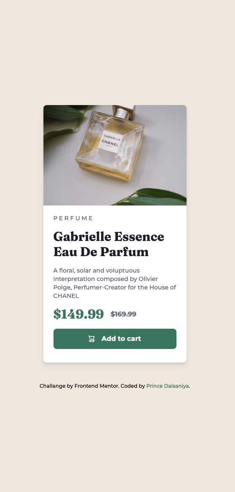

# Frontend Mentor - Product preview card component solution

This is a solution to the [Product preview card component challenge on Frontend Mentor](https://www.frontendmentor.io/challenges/product-preview-card-component-GO7UmttRfa). This solution will be using TailwindCss framework for styling. So, there is no styles.css or styles.scss if you are looking for it. All the styles are done by Tailwind classes.

## Table of contents

- [Frontend Mentor - Product preview card component solution](#frontend-mentor---product-preview-card-component-solution)
  - [Table of contents](#table-of-contents)
  - [Overview](#overview)
    - [The challenge](#the-challenge)
    - [Screenshot](#screenshot)
    - [Links](#links)
  - [My process](#my-process)
    - [Built with](#built-with)
    - [Continued development](#continued-development)
  - [Author](#author)

## Overview

### The challenge

Users should be able to:

- View the optimal layout depending on their device's screen size
- See hover and focus states for interactive elements

### Screenshot

### Links

- Solution URL: [Link](https://github.com/princedalsaniya/FM-Challenges/tree/main/NEWBIE/Product_preview_card_component)
- Live Site URL: [Link](https://princedalsaniya.github.io/FM-Challenges/NEWBIE/Product_preview_card_component/index.html)

## My process

### Built with

- [TailwindCSS](https://tailwindcss.com/) - A styling framework
- Semantic HTML5 markup
- Flexbox
- Mobile-first workflow

### Continued development

This was the first challenge I finished. And I am currently learning TailwindCss, so going forward I would be doing all challenges using that only. So, I can get better at using it. And I am not used to make mobileFirst approach, so yeah that is also something that I want to improve with this challanges.

## Author

- Github - [Prince Dalsaniya](https://github.com/princedalsaniya)
- Frontend Mentor - [@princedalsaniya](https://www.frontendmentor.io/profile/princedalsaniya)
